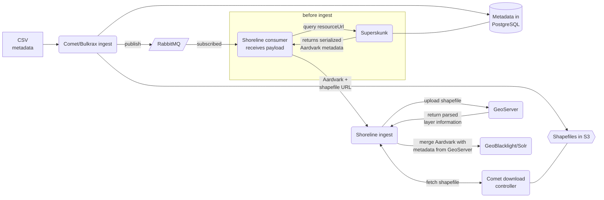

## Ingesting objects with Bulkrax

### Ingesting Geospatial Data

```mermaid
flowchart LR
    A[CSV \n metadata] --> B(Comet/Bulkrax ingest)
    B --> C[(Metadata in \n PostgreSQL)]
    B --> D{{Shapefiles in S3}}
    B -->|publish| E[/RabbitMQ/]
    E -->|subscribed| F(Shoreline consumer \n receives payload)
    F -->|query resourceUrl| G(Superskunk)
    G --- C
    subgraph before ingest
    G -->|returns serialized \n Aardvark metadata| F
    end
    F -->|Aardvark + \n shapefile URL| H(Shoreline ingest)
    H <-->|fetch shapefile| J(Comet download \n controller)
    J --- D
    H -->|upload shapefile| I(GeoServer)
    I -->|return parsed \n layer information| H
    H -->|merge Aardvark with \n metadata from GeoServer| K(GeoBlacklight/Solr)
```
