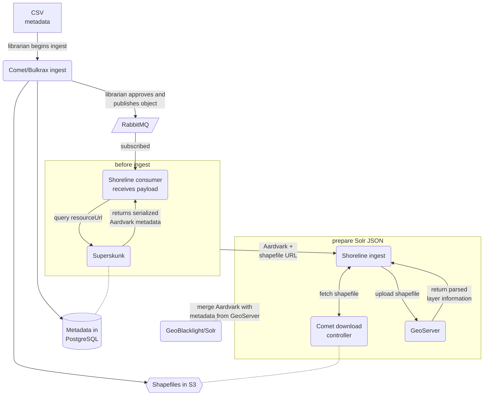

## Ingesting objects with Bulkrax

### Ingesting Geospatial Data

1. Batched objects are ingested into Comet via Bulkrax ([example
   CSV](https://gitlab.com/surfliner/surfliner/-/blob/trunk/comet/spec/fixtures/geodata/csv/recycledwatermains_metadata_m3.csv)).
1. When using the Shoreline mediated ingest workflow, objects ingested must be
   approved and published manually.  Once this is done, Comet publishes events
   to RabbitMQ
   ([`FileIngest#upload`](https://gitlab.com/surfliner/surfliner/-/blob/c2e65daa98b9f56c3232e8b9a95c748cccbe2c61/comet/app/services/file_ingest.rb#L99)
   =>
   [`RabbitMQListener`](https://gitlab.com/surfliner/surfliner/-/blob/c2e65daa98b9f56c3232e8b9a95c748cccbe2c61/comet/app/listeners/rabbitmq_listener.rb#L73-82)
   =>
   [`DiscoveryPlatformPublisher`](https://gitlab.com/surfliner/surfliner/-/blob/trunk/comet/app/services/discovery_platform_publisher.rb#L105-117)).
   The event payload includes a `resourceUrl`, which points to Superskunk.
1. The Shoreline consumer is a [standalone process that subscribes to the event
   stream](https://gitlab.com/surfliner/surfliner/-/blob/c2e65daa98b9f56c3232e8b9a95c748cccbe2c61/shoreline/bin/shoreline_consumer#L54-59)
   that Comet publishes to.  When it sees that an event has been published, it
   takes action based on [whether the event is for a new/updated object, or a
   deleted/unpublished
   object](https://gitlab.com/surfliner/surfliner/-/blob/c2e65daa98b9f56c3232e8b9a95c748cccbe2c61/shoreline/bin/shoreline_consumer#L77-87).
   In the latter case,
   [`Importer#delete`](https://gitlab.com/surfliner/surfliner/-/blob/c2e65daa98b9f56c3232e8b9a95c748cccbe2c61/shoreline/app/services/importer.rb#L14-45)
   is called, and the process is complete.
1. For new and updated objects, the Shoreline consumer uses the `resourceUrl`
   from the event payload to [query
   Superskunk](https://gitlab.com/surfliner/surfliner/-/blob/c2e65daa98b9f56c3232e8b9a95c748cccbe2c61/shoreline/bin/shoreline_consumer#L78).
   Superskunk, after confirming that the object metadata should be accessible,
   returns the metadata [serialized as
   Aardvark](https://gitlab.com/surfliner/surfliner/-/blob/c2e65daa98b9f56c3232e8b9a95c748cccbe2c61/superskunk/app/services/aardvark_serializer.rb).
1. The serialized metadata includes one non-standard field, `_file_urls`.  The
   value for this field is an array of URLs that can be used to query Comet for
   the binary shapefile data that was ingested via Bulkrax earlier.  Currently [Shoreline
   only supports a single
   shapefile](https://gitlab.com/surfliner/surfliner/-/blob/c2e65daa98b9f56c3232e8b9a95c748cccbe2c61/shoreline/bin/shoreline_consumer#L81-86)
   so we take the first and pass it to the importer with the Aardvark metadata.
1. [`Importer#ingest`](https://gitlab.com/surfliner/surfliner/-/blob/c2e65daa98b9f56c3232e8b9a95c748cccbe2c61/shoreline/app/services/importer.rb#L49)
   handles the rest: the shapefile is uploaded to GeoServer, then the Aardvark
   metadata is supplemented (if necessary) with metadata from GeoServer, after
   it has processed the shapefile itself.  Then the finalized JSON document is
   posted to Solr, and appears in the Shoreline interface.
